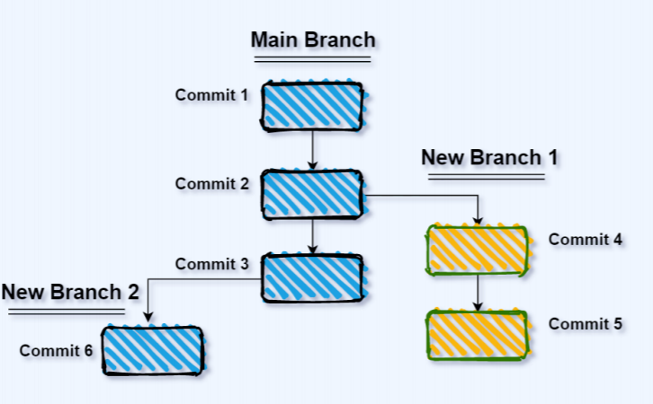
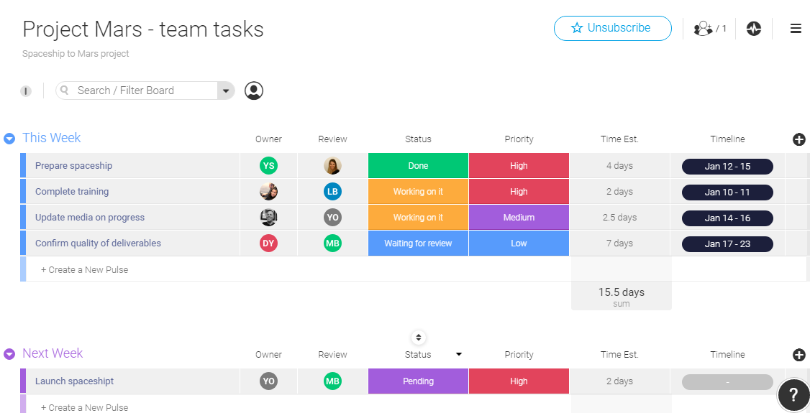
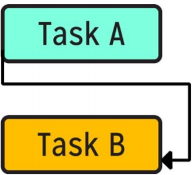
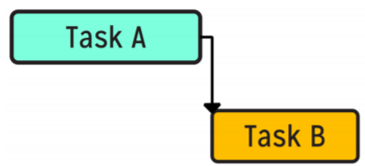
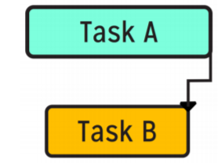
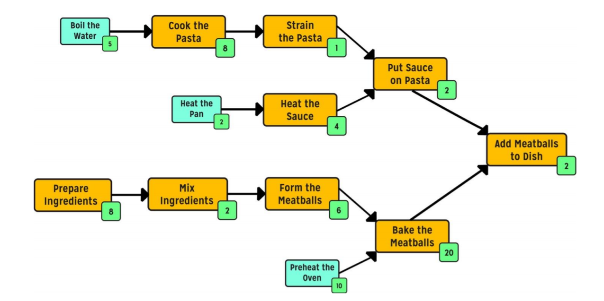

<!-- _class:  lead -->
 


# <!-- fit --> ───────────────────────────────────────────────────────────────────────────────────────────────────────────────────────────────────────
# <!-- fit --> Introduction to git and Github 
# <!-- fit --> ───────────────────────────────────────────────────────────────────────────────────────────────────────────────────────────────────────
Presented by: **BOUHSINE** Taha


--- 
 <!-- _class: default 
header: 'UIZ - Faculty of Science Agadir'
footer: Computer Science Students Club - Taha Bouhsine 
paginate: true
 -->


# Plan:
#### I. Introduction

#### II. Tasks in Software Product Management

#### III. Workshop

#### IV. git Conflicts/Disasters

#### V. Github cli/remote

---
<!-- _class:  default -->

## I. Introduction

#### 1. Goal of the workshop

#### 2. Commun Software Engineers Problems

#### 3. Version Control

---

#### 1. Goal of the workshop

---

#### 2. Commun Software Engineers Problems

* Communication

* Working with Another Person’s Code

* Backup

* Logging

---
<!-- 
Version control, also called Source control, allows you to track and
manage all of the changes to your code.
The main benefit of version control is that multiple people could work
on the same project simultaneously. With version control tools like Git,
you can track all of the changes to your code, and in case of any
problems, you could easily revert back to a working state of your source
code
With distributed version control systems like Git, you would have your
source code stored on a remote repository like GitHub and also a local
repository stored on your computer.
 -->

#### 3. Version Control



---
<!-- _class:  default -->

## II. Softwarre Product Managements

#### 1. Tasks

#### 2. Types of Task Dependencies


---

#### 1. Tasks



---

#### 2. Types of Task Dependencies

---
<!-- 
Start-start dependencies refer to those dependencies where the first
task must start before the second task can start. When tasks finish in
this dependency is not important.
Start-start dependencies are visually represented as follows, with an
arrow going from the beginning of Task A to the beginning of Task B.
The two tasks are shown more or less in parallel. Task B depends on
Task A starting.
 -->
#### Start-Start Dependency


---
<!-- 
Start-finish dependencies refer to dependencies where the first
task must begin before the second task can finish. These
dependencies generally involve some kind of overlapping handover.
In start-finish dependencies, the start of the second task is not
important. In other words, the first task can start before or after the
second task starts.
Start-finish dependencies are visually represented as follows, with
an arrow going from the beginning of Task A towards the end of
Task B. Both tasks are shown more or less in parallel. Task A must start before Task B finishes. 
 -->
#### Start-Finish Dependency


---
<!-- 
Finish-start dependencies refer to
dependencies where the first task must
finish before the second task can start. This
is the most common type of dependency.
Finish-start dependencies are visually
represented as follows, with an arrow going
from the end of Task A to the beginning of
Task B. Task B does not overlap with the
Task A bar in any way. Task A must finish before Task B can begin.
 -->

#### Finish-Start Dependency



---
<!-- 
Finish-finish dependencies occur when the first task must
finish before the second task can finish.
Finish-finish dependencies are visually represented as
follows, with an arrow going from the end of Task A to the
end of Task B. The two tasks are parallel to each other. The
arrow shows how task A must finish before Task B can
finish.
 -->

#### Finish-Finish Dependency



---

#### Critical Path Method (CPM) Charts



---
<!-- _class:  default -->


## III. Workshop init

#### 1. To Do Tasks

#### 2. Init/clone

#### 3. Add Changes to Index

---

### To Do Tasks

---

### Config

```bash
git config --global user.name "fsacssc"
git config --global user.email fsacssc@gmail.com
git config --list
nano ~/.gitconfig
```

---

### Init

```bash
git init
```

---

#### Add changes to index

```bash
git add <filename>
git add *
```

---

#### Commit changes to Head with a message

```bash
git commit -m "Commit message"
```

---

#### Create a new branch named task_1 and switch to it

```bash
git checkout -b task_1
```

---

#### Switch back to the master's branch

```bash
git checkout master
```

---

#### Preview Difference between 2 branches

```bash
git diff task_1 master
```

---

#### Merge the current branch with task_1

```bash
git merge task_1
```

---

#### Delete task_1 branch

```bash
git branch -d task_1
```

---

#### IV- Git Conflicts


---

```bash
git add <filename>
```

---

```bash
git diff <source_branch> <target_branch>
```

---

### git log

```bash
git log
git log --author=bob
```

---

#### V- Github Remote

---

### Clone from remote

```bash
git clone /path/to/repository
```

---

### Push to remote branch

```bash
git push origin task_1
```

---

### Create pull request

---

# Important points to remember

- never merge/push to master
- Always pull before you push/merge branches
- git good

---

#### Git Disasters
[git Disasters](https://randyfay.com/content/avoiding-git-disasters-gory-story)

---
## References
[version control](https://medium.com/learnfazz/version-control-solution-to-software-teams-problem-fe75b061a8ef)
[git Guide](https://rogerdudler.github.io/git-guide/)
[git Disasters](https://randyfay.com/content/avoiding-git-disasters-gory-story)
[git guide book](https://github.com/bobbyiliev/introduction-to-git-and-github-ebook)

---
<!-- backgroundImage: url('hero-background-dark.jpg') -->
<!-- _class:  invert lead-->
  
# Thank you
###### Github : [@skywolfmo](https://github.com/skywolfmo)
###### LinkedIn : [@tahabsn](https://www.linkedin.com/in/tahabsn/)